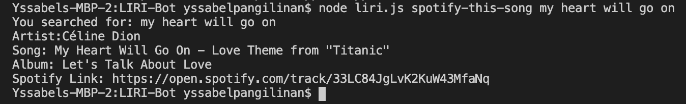
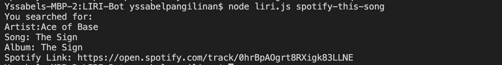
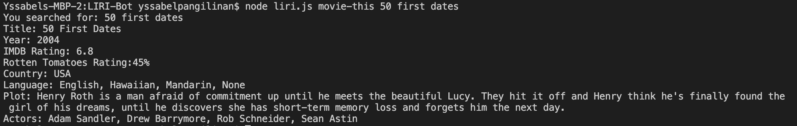
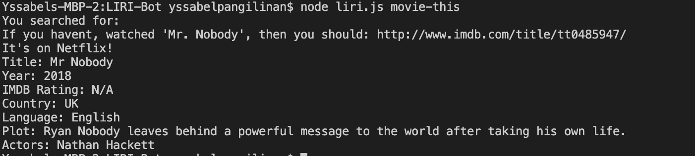
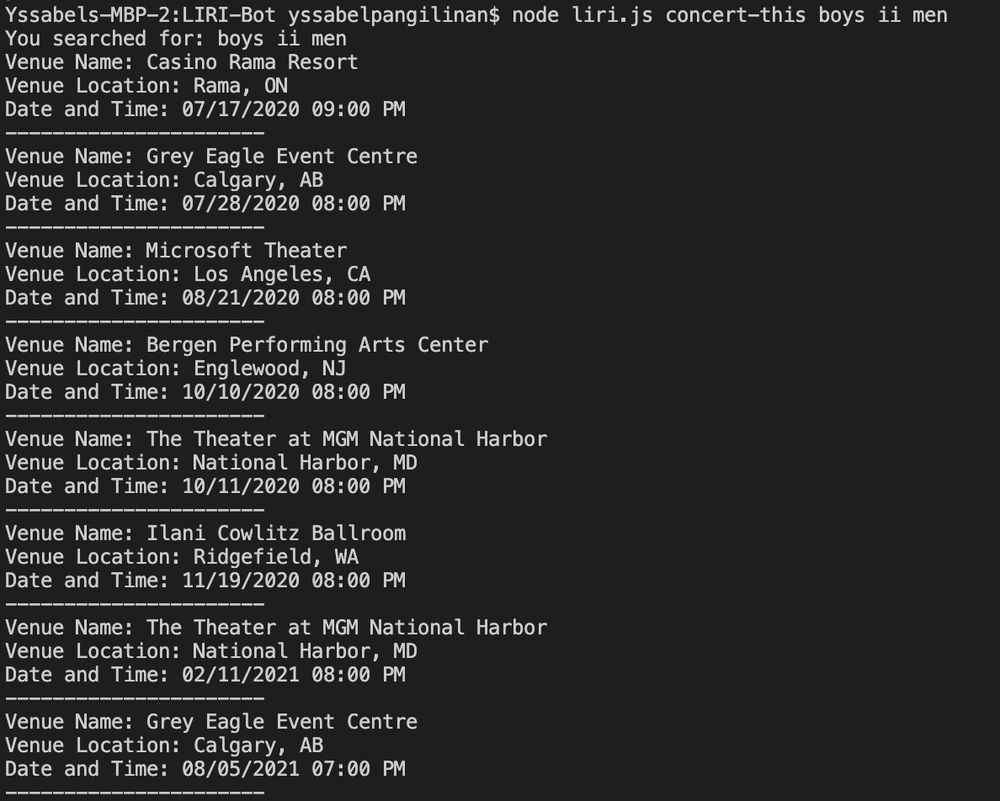
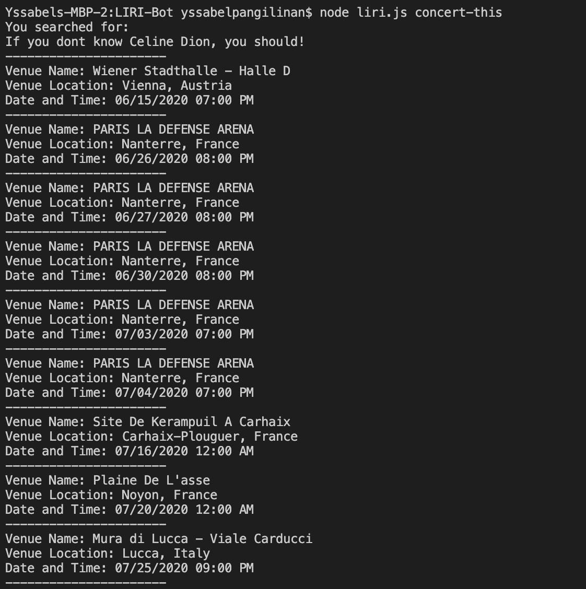
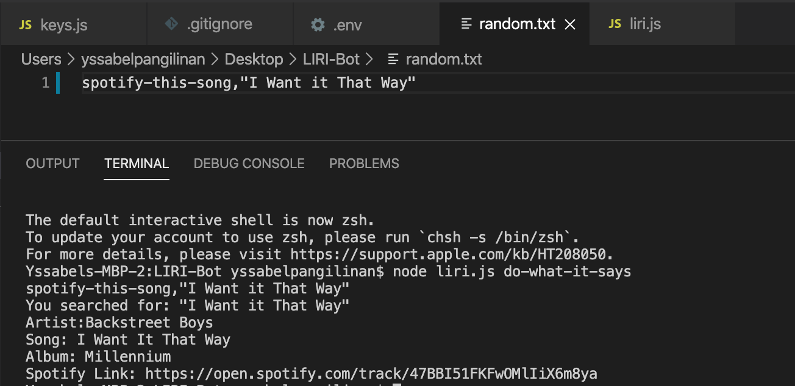
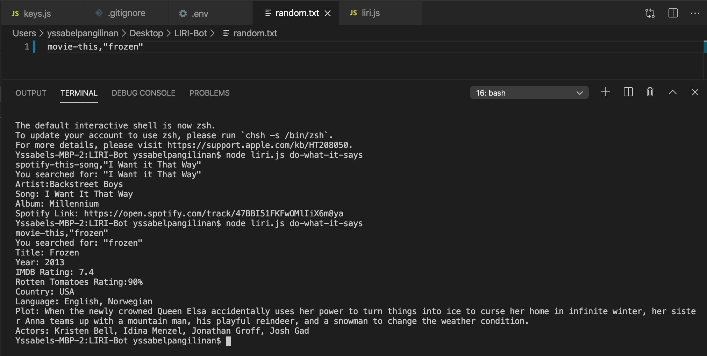
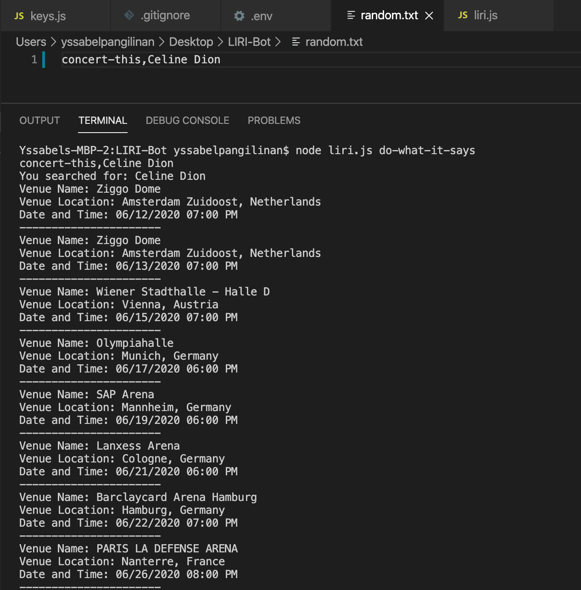

# LIRI-Bot

## Assignment Overview

LIRI is like iPhone's SIRI. However, while SIRI is a Speech Interpretation and Recognition Interface, LIRI is a _Language_ Interpretation and Recognition Interface. LIRI will be a command line node app that takes in parameters and gives you back data.

For this specific LIRI command line node app, the user can input the parameters, "spotify-this-song", "movie-this", "concert-this", and "do-what-it-says" and the app will provide the user the data they requested. 

### How was this app created?
LIRI was created with Node.JS and utilizes the following packages and API's:
  * [Node-Spotify-API](https://www.npmjs.com/package/node-spotify-api)
  * [Axios](https://www.npmjs.com/package/axios)
  * [Moment](https://www.npmjs.com/package/moment)
  * [DotEnv](https://www.npmjs.com/package/dotenv)
  * [OMDB API](http://www.omdbapi.com)
  * [Bands In Town API](http://www.artists.bandsintown.com/bandsintown-api)
  
### Want to see examples of how it works?
Because LIRI is a CLI app, it cannot be deployed on GitHub pages, but below you can find screenshots of the functioning app with the various parameters that can be used. 

**SPOTIFY-THIS-SONG** 
This command will utilize the Spotify package and output:
* Artist(s)
* The song's name
* A preview link of the song from Spotify
* The album that the song is from
 
Searching for the song "My Heart Will Go On":

If the user does not type in a movie name, it will automatically output data for "The Sign"

**MOVIE-THIS** 
This command will utilize the OMDB API and output:
* Title of the movie.
* Year the movie came out.
* IMDB Rating of the movie.
* Rotten Tomatoes Rating of the movie.
* Country where the movie was produced.
* Language of the movie.
* Plot of the movie.
* Actors in the movie.
 
Searching for the movie "50 First Dates":

If the user does not type in a movie name, it will automatically output data for "Mr. Nobody"

**CONCERT-THIS** 
This command will utilize the Bands in Town API and output:
 * Name of the venue
 * Venue location
 * Date of the Event 
  
Searching for a concert for "Boys II Men":
 
If the user does not type in a movie name, it will automatically output data for "Celine Dion" 

**DO-WHAT-IT-SAYS** 
This command will read what is in the provded random.txt and perform the command that is listed within it.
*Do-what-it-says: Spotify-this-song*

*Do-what-it-says: Movie-this*

*Do-what-it-says: Concert-this*

